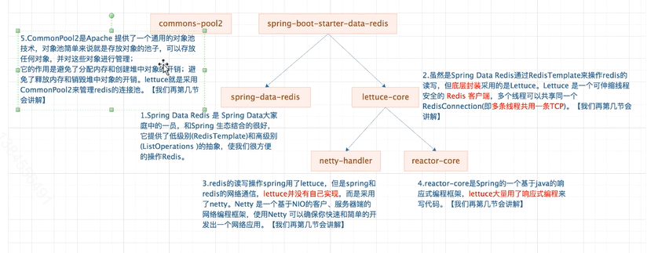
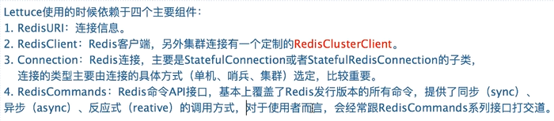

# Docker 安装
docker create --name redis-node-1 --net host --privileged=true -v /data/redis/share/redis-node-1:/data redis:5.0.7 --cluster-enabled yes --appendonly yes --port 6381
docker create --name redis-node-2 --net host --privileged=true -v /data/redis/share/redis-node-2:/data redis:5.0.7 --cluster-enabled yes --appendonly yes --port 6382
docker create --name redis-node-3 --net host --privileged=true -v /data/redis/share/redis-node-3:/data redis:5.0.7 --cluster-enabled yes --appendonly yes --port 6383
docker create --name redis-node-4 --net host --privileged=true -v /data/redis/share/redis-node-4:/data redis:5.0.7 --cluster-enabled yes --appendonly yes --port 6384
docker create --name redis-node-5 --net host --privileged=true -v /data/redis/share/redis-node-5:/data redis:5.0.7 --cluster-enabled yes --appendonly yes --port 6385
docker create --name redis-node-6 --net host --privileged=true -v /data/redis/share/redis-node-6:/data redis:5.0.7 --cluster-enabled yes --appendonly yes --port 6386
--name 指定名称
--net host 指定网络 host使用本机的ip
--privileged=true   docker 获取主机的root权限。
-v 指定放数据的路径
--cluster-enabled yes //redis.conf 是否开启redis集群
--appendonly yes //redis.conf 是否开启数据持久化
--port //redis.conf

## docker start
docker start redis-node-1 redis-node-2 redis-node-3 redis-node-4 redis-node-5 redis-node-6

## redis 主从设置
redis-cli --cluster create 47.96.154.52:6381 47.96.154.52:6382 47.96.154.52:6383 47.96.154.52:6384 47.96.154.52:6385 47.96.154.52:6386 --cluster-replicas 1
-----------------------------------------------------------------------------------------------------------------------------------------------------------
root@linhu:/data# redis-cli --cluster create 47.96.154.52:6381 47.96.154.52:6382 47.96.154.52:6383 47.96.154.52:6384 47.96.154.52:6385 47.96.154.52:6386 --cluster-replicas 1
>>> Performing hash slots allocation on 6 nodes...
Master[0] -> Slots 0 - 5460
Master[1] -> Slots 5461 - 10922
Master[2] -> Slots 10923 - 16383
Adding replica 47.96.154.52:6385 to 47.96.154.52:6381
Adding replica 47.96.154.52:6386 to 47.96.154.52:6382
Adding replica 47.96.154.52:6384 to 47.96.154.52:6383
>>> Trying to optimize slaves allocation for anti-affinity
[WARNING] Some slaves are in the same host as their master
M: cbfd5ea86892658b655b37f1285a3b69b6477a6e 47.96.154.52:6381
   slots:[0-5460] (5461 slots) master
M: e66c662cfd5ff7edb309a6269fc4ccbfe2255ab5 47.96.154.52:6382
   slots:[5461-10922] (5462 slots) master
M: 7faae4ae22784e4cade5abcbfb8ae85e79a4aabe 47.96.154.52:6383
   slots:[10923-16383] (5461 slots) master
S: 29adc83419a78d3dae6e82aaccbb21bed50d1b01 47.96.154.52:6384
   replicates cbfd5ea86892658b655b37f1285a3b69b6477a6e
S: 16b2fb7ae8380d7db6cf40bf9228d3c5487a59ec 47.96.154.52:6385
   replicates e66c662cfd5ff7edb309a6269fc4ccbfe2255ab5
S: a895e30ca0b76ec27997becae6b6deab1e3bf566 47.96.154.52:6386
   replicates 7faae4ae22784e4cade5abcbfb8ae85e79a4aabe
Can I set the above configuration? (type 'yes' to accept): yes
>>> Nodes configuration updated
>>> Assign a different config epoch to each node
>>> Sending CLUSTER MEET messages to join the cluster
Waiting for the cluster to join
......
>>> Performing Cluster Check (using node 47.96.154.52:6381)
M: cbfd5ea86892658b655b37f1285a3b69b6477a6e 47.96.154.52:6381
   slots:[0-5460] (5461 slots) master
   1 additional replica(s)
S: 16b2fb7ae8380d7db6cf40bf9228d3c5487a59ec 47.96.154.52:6385
   slots: (0 slots) slave
   replicates e66c662cfd5ff7edb309a6269fc4ccbfe2255ab5
M: e66c662cfd5ff7edb309a6269fc4ccbfe2255ab5 47.96.154.52:6382
   slots:[5461-10922] (5462 slots) master
   1 additional replica(s)
M: 7faae4ae22784e4cade5abcbfb8ae85e79a4aabe 47.96.154.52:6383
   slots:[10923-16383] (5461 slots) master
   1 additional replica(s)
S: a895e30ca0b76ec27997becae6b6deab1e3bf566 47.96.154.52:6386
   slots: (0 slots) slave
   replicates 7faae4ae22784e4cade5abcbfb8ae85e79a4aabe
S: 29adc83419a78d3dae6e82aaccbb21bed50d1b01 47.96.154.52:6384
   slots: (0 slots) slave
   replicates cbfd5ea86892658b655b37f1285a3b69b6477a6e
[OK] All nodes agree about slots configuration.
>>> Check for open slots...
>>> Check slots coverage...
[OK] All 16384 slots covered.
-----
cluster info  查看集群的状态
cluster_state:ok                    //集群状态
cluster_slots_assigned:16384        //被分配槽的位数
cluster_slots_ok:16384              //正确被分的槽数
cluster_slots_pfail:0
cluster_slots_fail:0
cluster_known_nodes:6
cluster_size:3
cluster_current_epoch:6
cluster_my_epoch:1
cluster_stats_messages_ping_sent:134
cluster_stats_messages_pong_sent:157
cluster_stats_messages_sent:291
cluster_stats_messages_ping_received:152
cluster_stats_messages_pong_received:134
cluster_stats_messages_meet_received:5
cluster_stats_messages_received:291

---
cluster nodes 集群的节点的状态
16b2fb7ae8380d7db6cf40bf9228d3c5487a59ec 47.96.154.52:6385@16385 slave e66c662cfd5ff7edb309a6269fc4ccbfe2255ab5 0 1605163550053 5 connected
e66c662cfd5ff7edb309a6269fc4ccbfe2255ab5 47.96.154.52:6382@16382 master - 0 1605163552000 2 connected 5461-10922
7faae4ae22784e4cade5abcbfb8ae85e79a4aabe 47.96.154.52:6383@16383 master - 0 1605163551054 3 connected 10923-16383
a895e30ca0b76ec27997becae6b6deab1e3bf566 47.96.154.52:6386@16386 slave 7faae4ae22784e4cade5abcbfb8ae85e79a4aabe 0 1605163549000 6 connected
29adc83419a78d3dae6e82aaccbb21bed50d1b01 47.96.154.52:6384@16384 slave cbfd5ea86892658b655b37f1285a3b69b6477a6e 0 1605163553057 4 connected
cbfd5ea86892658b655b37f1285a3b69b6477a6e 172.16.176.32:6381@16381 myself,master - 0 1605163550000 1 connected 0-5460
---
 redis-cli --cluster check 127.0.0.1:6381 集群信息
--
如果是用了redis集群，那么如果链接的时候需要加 -c
redis-cli -p 6381 -c -h 127.0.0.1
## 主从切换
**先看节点信息**
29adc83419a78d3dae6e82aaccbb21bed50d1b01 47.96.154.52:6384@16384 slave cbfd5ea86892658b655b37f1285a3b69b6477a6e 0 1605164571000 4 connected
7faae4ae22784e4cade5abcbfb8ae85e79a4aabe 47.96.154.52:6383@16383 master - 0 1605164570000 3 connected 10923-16383
e66c662cfd5ff7edb309a6269fc4ccbfe2255ab5 172.16.176.32:6382@16382 myself,master - 0 1605164569000 2 connected 5461-10922
a895e30ca0b76ec27997becae6b6deab1e3bf566 47.96.154.52:6386@16386 slave 7faae4ae22784e4cade5abcbfb8ae85e79a4aabe 0 1605164571593 6 connected
cbfd5ea86892658b655b37f1285a3b69b6477a6e 47.96.154.52:6381@16381 master - 0 1605164570592 1 connected 0-5460
16b2fb7ae8380d7db6cf40bf9228d3c5487a59ec 47.96.154.52:6385@16385 slave e66c662cfd5ff7edb309a6269fc4ccbfe2255ab5 0 1605164570000 5 connected
-------------------------------------------------------------------------------------------------------------------------------------------
**再次查看节点信息**
127.0.0.1:6382> CLUSTER NODES
29adc83419a78d3dae6e82aaccbb21bed50d1b01 47.96.154.52:6384@16384 master - 0 1605164725000 7 connected 0-5460
7faae4ae22784e4cade5abcbfb8ae85e79a4aabe 47.96.154.52:6383@16383 master - 0 1605164724000 3 connected 10923-16383
e66c662cfd5ff7edb309a6269fc4ccbfe2255ab5 172.16.176.32:6382@16382 myself,master - 0 1605164723000 2 connected 5461-10922
a895e30ca0b76ec27997becae6b6deab1e3bf566 47.96.154.52:6386@16386 slave 7faae4ae22784e4cade5abcbfb8ae85e79a4aabe 0 1605164725094 6 connected
cbfd5ea86892658b655b37f1285a3b69b6477a6e 47.96.154.52:6381@16381 master,fail - 1605164643449 1605164641000 1 disconnected
16b2fb7ae8380d7db6cf40bf9228d3c5487a59ec 47.96.154.52:6385@16385 slave e66c662cfd5ff7edb309a6269fc4ccbfe2255ab5 0 1605164726097 5 connected
-------------------------------------------------------------------------------------------------------------------------------------------
## 集群扩容
1. 加两个redis 节点。
docker create --name redis-node-7 --net host --privileged=true -v /data/redis/share/redis-node-7:/data redis:5.0.7 --cluster-enabled yes --appendonly yes --port 6387
docker create --name redis-node-8 --net host --privileged=true -v /data/redis/share/redis-node-8:/data redis:5.0.7 --cluster-enabled yes --appendonly yes --port 6388
2. 进入容器
docker exec -it redis-node-7 /bin/bash

3. 新加节点到cluster
   redis-cli --cluster add-node 127.0.0.1:6387 127.0.0.1:6381
   127.0.0.1:6387 第一个代表的是新加的节点。
   127.0.0.1:6381 第二的节点是集群中的任意的一个节点。
---
但是没有被分配槽号。
```
eg:  
root@linhu:/data#    redis-cli --cluster add-node 127.0.0.1:6387 127.0.0.1:6381
>>> Adding node 127.0.0.1:6387 to cluster 127.0.0.1:6381
>>> Performing Cluster Check (using node 127.0.0.1:6381)
M: cbfd5ea86892658b655b37f1285a3b69b6477a6e 127.0.0.1:6381
   slots:[0-5460] (5461 slots) master
   1 additional replica(s)
M: 7faae4ae22784e4cade5abcbfb8ae85e79a4aabe 47.96.154.52:6383
   slots:[10923-16383] (5461 slots) master
   1 additional replica(s)
S: 29adc83419a78d3dae6e82aaccbb21bed50d1b01 47.96.154.52:6384
   slots: (0 slots) slave
   replicates cbfd5ea86892658b655b37f1285a3b69b6477a6e
S: 16b2fb7ae8380d7db6cf40bf9228d3c5487a59ec 47.96.154.52:6385
   slots: (0 slots) slave
   replicates e66c662cfd5ff7edb309a6269fc4ccbfe2255ab5
M: e66c662cfd5ff7edb309a6269fc4ccbfe2255ab5 47.96.154.52:6382
   slots:[5461-10922] (5462 slots) master
   1 additional replica(s)
S: a895e30ca0b76ec27997becae6b6deab1e3bf566 47.96.154.52:6386
   slots: (0 slots) slave
   replicates 7faae4ae22784e4cade5abcbfb8ae85e79a4aabe
[OK] All nodes agree about slots configuration.
>>> Check for open slots...
>>> Check slots coverage...
[OK] All 16384 slots covered.
>>> Send CLUSTER MEET to node 127.0.0.1:6387 to make it join the cluster.
[OK] New node added correctly.
```

```
root@linhu:/data# redis-cli --cluster check 127.0.0.1:6381
127.0.0.1:6381 (cbfd5ea8...) -> 0 keys | 5461 slots | 1 slaves.
47.96.154.52:6383 (7faae4ae...) -> 1 keys | 5461 slots | 1 slaves.
127.0.0.1:6387 (b8020317...) -> 0 keys | 0 slots | 0 slaves.
47.96.154.52:6382 (e66c662c...) -> 1 keys | 5462 slots | 1 slaves.
[OK] 2 keys in 4 masters.
0.00 keys per slot on average.
>>> Performing Cluster Check (using node 127.0.0.1:6381)
M: cbfd5ea86892658b655b37f1285a3b69b6477a6e 127.0.0.1:6381
   slots:[0-5460] (5461 slots) master
   1 additional replica(s)
M: 7faae4ae22784e4cade5abcbfb8ae85e79a4aabe 47.96.154.52:6383
   slots:[10923-16383] (5461 slots) master
   1 additional replica(s)
S: 29adc83419a78d3dae6e82aaccbb21bed50d1b01 47.96.154.52:6384
   slots: (0 slots) slave
   replicates cbfd5ea86892658b655b37f1285a3b69b6477a6e
S: 16b2fb7ae8380d7db6cf40bf9228d3c5487a59ec 47.96.154.52:6385
   slots: (0 slots) slave
   replicates e66c662cfd5ff7edb309a6269fc4ccbfe2255ab5
M: b802031799b22f7d8c9d72adc3576d52ac6358c7 127.0.0.1:6387
   slots: (0 slots) master
M: e66c662cfd5ff7edb309a6269fc4ccbfe2255ab5 47.96.154.52:6382
   slots:[5461-10922] (5462 slots) master
   1 additional replica(s)
S: a895e30ca0b76ec27997becae6b6deab1e3bf566 47.96.154.52:6386
   slots: (0 slots) slave
   replicates 7faae4ae22784e4cade5abcbfb8ae85e79a4aabe
[OK] All nodes agree about slots configuration.
>>> Check for open slots...
>>> Check slots coverage...
[OK] All 16384 slots covered.
```

---
4. 重新分配槽号。  
redis-cli --cluster reshard 127.0.0.1:6381  
                            anyone of nodes
```
127.0.0.1:6381 (cbfd5ea8...) -> 0 keys | 4096 slots | 1 slaves.
47.96.154.52:6383 (7faae4ae...) -> 1 keys | 4096 slots | 1 slaves.
127.0.0.1:6387 (b8020317...) -> 0 keys | 4096 slots | 0 slaves.
47.96.154.52:6382 (e66c662c...) -> 1 keys | 4096 slots | 1 slaves.
[OK] 2 keys in 4 masters.
0.00 keys per slot on average.
>>> Performing Cluster Check (using node 127.0.0.1:6381)
M: cbfd5ea86892658b655b37f1285a3b69b6477a6e 127.0.0.1:6381
   slots:[1365-5460] (4096 slots) master
   1 additional replica(s)
M: 7faae4ae22784e4cade5abcbfb8ae85e79a4aabe 47.96.154.52:6383
   slots:[12288-16383] (4096 slots) master
   1 additional replica(s)
S: 29adc83419a78d3dae6e82aaccbb21bed50d1b01 47.96.154.52:6384
   slots: (0 slots) slave
   replicates cbfd5ea86892658b655b37f1285a3b69b6477a6e
S: 16b2fb7ae8380d7db6cf40bf9228d3c5487a59ec 47.96.154.52:6385
   slots: (0 slots) slave
   replicates e66c662cfd5ff7edb309a6269fc4ccbfe2255ab5
M: b802031799b22f7d8c9d72adc3576d52ac6358c7 127.0.0.1:6387
   slots:[0-1364],[5461-6826],[10923-12287] (4096 slots) master
M: e66c662cfd5ff7edb309a6269fc4ccbfe2255ab5 47.96.154.52:6382
   slots:[6827-10922] (4096 slots) master
   1 additional replica(s)
S: a895e30ca0b76ec27997becae6b6deab1e3bf566 47.96.154.52:6386
   slots: (0 slots) slave
   replicates 7faae4ae22784e4cade5abcbfb8ae85e79a4aabe
[OK] All nodes agree about slots configuration.
>>> Check for open slots...
>>> Check slots coverage...
[OK] All 16384 slots covered.
```

5.为master4(node7)添加从节点。  
redis-cli --cluster add-node 127.0.0.1:6388 127.0.0.1:6387 --cluster-slave --cluster-master-id b802031799b22f7d8c9d72adc3576d52ac6358c7  
                               new node       新节点的master                                    master id
```
127.0.0.1:6381 (cbfd5ea8...) -> 0 keys | 4096 slots | 1 slaves.
47.96.154.52:6383 (7faae4ae...) -> 1 keys | 4096 slots | 1 slaves.
127.0.0.1:6387 (b8020317...) -> 0 keys | 4096 slots | 1 slaves.
47.96.154.52:6382 (e66c662c...) -> 1 keys | 4096 slots | 1 slaves.
[OK] 2 keys in 4 masters.
0.00 keys per slot on average.
>>> Performing Cluster Check (using node 127.0.0.1:6381)
M: cbfd5ea86892658b655b37f1285a3b69b6477a6e 127.0.0.1:6381
   slots:[1365-5460] (4096 slots) master
   1 additional replica(s)
M: 7faae4ae22784e4cade5abcbfb8ae85e79a4aabe 47.96.154.52:6383
   slots:[12288-16383] (4096 slots) master
   1 additional replica(s)
S: 29adc83419a78d3dae6e82aaccbb21bed50d1b01 47.96.154.52:6384
   slots: (0 slots) slave
   replicates cbfd5ea86892658b655b37f1285a3b69b6477a6e
S: 16b2fb7ae8380d7db6cf40bf9228d3c5487a59ec 47.96.154.52:6385
   slots: (0 slots) slave
   replicates e66c662cfd5ff7edb309a6269fc4ccbfe2255ab5
M: b802031799b22f7d8c9d72adc3576d52ac6358c7 127.0.0.1:6387
   slots:[0-1364],[5461-6826],[10923-12287] (4096 slots) master
   1 additional replica(s)
M: e66c662cfd5ff7edb309a6269fc4ccbfe2255ab5 47.96.154.52:6382
   slots:[6827-10922] (4096 slots) master
   1 additional replica(s)
S: 4ba16ced96414bf305d552f4a917cb030cde572d 127.0.0.1:6388
   slots: (0 slots) slave
   replicates b802031799b22f7d8c9d72adc3576d52ac6358c7
S: a895e30ca0b76ec27997becae6b6deab1e3bf566 47.96.154.52:6386
   slots: (0 slots) slave
   replicates 7faae4ae22784e4cade5abcbfb8ae85e79a4aabe
[OK] All nodes agree about slots configuration.
>>> Check for open slots...
>>> Check slots coverage...
[OK] All 16384 slots covered.
```

## 集群槽收索
target : delete node 7 and node 8  
reshard the slots  
1.把6387master 对于的 slaver 6388 删除  
redis-cli --cluster del-node 127.0.0.1:6388 4ba16ced96414bf305d552f4a917cb030cde572d  
                                delete node     delete node id
```
>>> Removing node 4ba16ced96414bf305d552f4a917cb030cde572d from cluster 127.0.0.1:6388
>>> Sending CLUSTER FORGET messages to the cluster...
>>> SHUTDOWN the node.
```
不过docker里面的容器也被删掉了。
2.重新分配master的slot
redis-cli --cluster reshard 127.0.0.1:6381  
                                集群中的任意节点
```
127.0.0.1:6381 (cbfd5ea8...) -> 0 keys | 8192 slots | 1 slaves.
47.96.154.52:6383 (7faae4ae...) -> 1 keys | 2730 slots | 1 slaves.
127.0.0.1:6387 (b8020317...) -> 0 keys | 2731 slots | 0 slaves.
47.96.154.52:6382 (e66c662c...) -> 1 keys | 2731 slots | 1 slaves.
[OK] 2 keys in 4 masters.
0.00 keys per slot on average.
>>> Performing Cluster Check (using node 127.0.0.1:6381)
M: cbfd5ea86892658b655b37f1285a3b69b6477a6e 127.0.0.1:6381
   slots:[0-5460],[6827-8191],[12288-13653] (8192 slots) master
   1 additional replica(s)
M: 7faae4ae22784e4cade5abcbfb8ae85e79a4aabe 47.96.154.52:6383
   slots:[13654-16383] (2730 slots) master
   1 additional replica(s)
S: 29adc83419a78d3dae6e82aaccbb21bed50d1b01 47.96.154.52:6384
   slots: (0 slots) slave
   replicates cbfd5ea86892658b655b37f1285a3b69b6477a6e
S: 16b2fb7ae8380d7db6cf40bf9228d3c5487a59ec 47.96.154.52:6385
   slots: (0 slots) slave
   replicates e66c662cfd5ff7edb309a6269fc4ccbfe2255ab5
M: b802031799b22f7d8c9d72adc3576d52ac6358c7 127.0.0.1:6387
   slots:[5461-6826],[10923-12287] (2731 slots) master
M: e66c662cfd5ff7edb309a6269fc4ccbfe2255ab5 47.96.154.52:6382
   slots:[8192-10922] (2731 slots) master
   1 additional replica(s)
S: a895e30ca0b76ec27997becae6b6deab1e3bf566 47.96.154.52:6386
   slots: (0 slots) slave
   replicates 7faae4ae22784e4cade5abcbfb8ae85e79a4aabe
[OK] All nodes agree about slots configuration.
>>> Check for open slots...
>>> Check slots coverage...
[OK] All 16384 slots covered.
```

3.master 的 slavr 已被清除，可以直接删除。
redis-cli --cluster del-node 127.0.0.1:6387 b802031799b22f7d8c9d72adc3576d52ac6358c7
```
root@linhu:/data# redis-cli --cluster del-node 127.0.0.1:6387 b802031799b22f7d8c9d72adc3576d52ac6358c7
>>> Removing node b802031799b22f7d8c9d72adc3576d52ac6358c7 from cluster 127.0.0.1:6387
>>> Sending CLUSTER FORGET messages to the cluster...
>>> SHUTDOWN the node.
```

## redis 图解


## 什么是Lettuce



## 基于Lettuce单机链接redis


## 基于Lettuce集群链接redis


