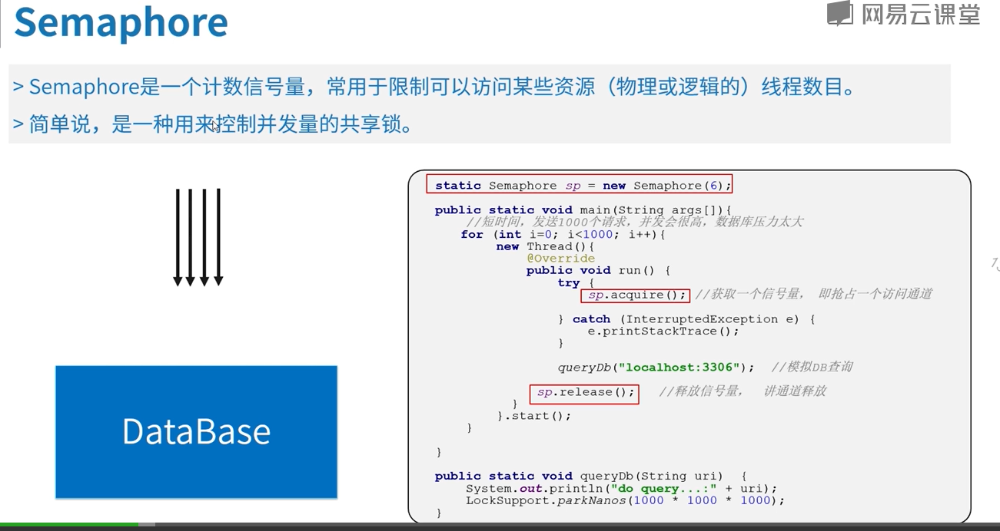

# HashCode
这个对象在hash表中的位置。通过对象的物理地址转为为一个整数，然后通过hash函数进行计算而得到的。
# & 位与运算
hasMap大小8       8-1=7

| 0001 1001 1110 0101 1111                      |
|:----------------------------------------------|
| 0000 0000 0000 0000 0111                      |
| 0000 0000 0000 0000 0111                      |

---
求余函数 可以使用& 来使用。好处是不需要计算机将数据再次转换为二进制。可以提升性能。
创建的map的数组大小最后保证（size-1）的二级制的末尾是以1结尾的。

hashMap 默认长度是16
---------------
# 红黑树
## 满足条件
1.左节点比父节点小，右节点比父节点大。
2.根节点一定为黑色。
链表长度大于8会进行转树。
# currentHasMap
安全又有性能的原因之一：
只会锁某一列，其他tab的是可以被操作的。
1.在初始话的时候会给一个最接近我们给的数组的2^n+1的数。
# Semaphore

